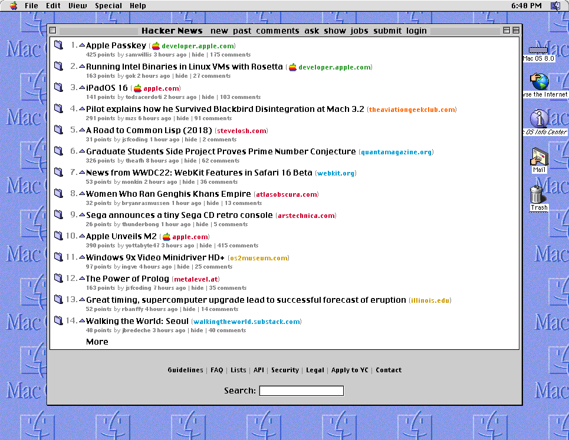

# Hackertosh.css - Make HackerNews Look Like MacOS 8

  

  

    
  

A custom style sheet to make [HackerNews](https://news.ycombinator.com/) look like MacOS 8.

## Installation

**Firefox**

Either [install the extension](https://addons.mozilla.org/en-US/firefox/addon/hackertosh-css/) from AMO, or add the `userContent.css` from the [release page](https://github.com/anthmn/hackertosh.css/releases) to your user style sheet.

## License

CSS code (C) 2022 Anthony Mancini. Licensed under AGPL-3.0.

Virtue font (C) 1997-1999 Marty P. Pfeiffer at Scooter Graphics.

